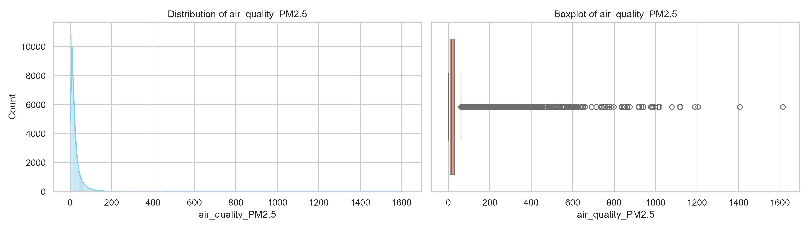

# Member 2 – Exploratory Data Analysis (EDA) Report

## 1. Executive Summary
Conducted a thorough Exploratory Data Analysis on the cleaned global weather dataset. The purpose of this analysis is to understand key feature distributions, identify target imbalances, and evaluate cross-correlations to assist feature engineering and model construction steps.

## 2. Target Variable Analysis (`condition_text`)
* **Extreme Class Imbalance:** The target categories are heavily dominated by `Partly Cloudy` and `Sunny` states. Rare weather occurrences (e.g., Freezing Drizzle, Blizzard) appear extremely infrequently.
* **Data Consistency:** Identified minor structural duplicates in raw entries (e.g., case variations like "Partly cloudy" vs "Partly Cloudy") and resolved them by casting text strings to Title Case.
* **Modeling Impact:** Members 4–7 should implement stratifying practices or consider balancing methods to handle class performance degradation on minority classes.

## 3. Key Feature Correlations & Trends
* **Collinearity Warnings:** `temperature_celsius` and `feels_like_celsius` display a near-perfect positive linear relationship (~1.00). To avoid severe multicollinearity issues, the model pipelines should drop one of these metrics.
* **Predictive Indicators:** Features such as `humidity`, `cloud`, and `uv_index` exhibit clean variations across distinct weather blocks, marking them out as strong potential prediction variables.
* **Redundant Variables:** Metric units pairs (Celsius vs Fahrenheit, mph vs kph, millibars vs inches) are functionally identical duplicates. The filtered matrix isolate individual metrics for clean interpretability.

## 4. Key Numerical Distributions & Observations

### A. Geographic Spread (`latitude` & `longitude`)
* **Observations:** The geographic features show multiple distinct peaks rather than a standard bell curve. This indicates that our data is tightly clustered around specific major monitoring stations globally.
* **Outliers:** No significant outliers exist in these spatial metrics since coordinates are bound to global limits.

### B. Air Quality Insights (`air_quality_PM2.5`)
* **Observations:** This feature is heavily right-skewed. The vast majority of readings sit near zero (clean air), but there is a long tail extending past 1000.
* **Anomalies/Outliers:** The boxplot exposes a massive dense trail of individual extreme data points (outliers). This signifies specialized localized pollution incidents or sensor anomalies that Members 4–7 should address via scaling or clipping transformation.
